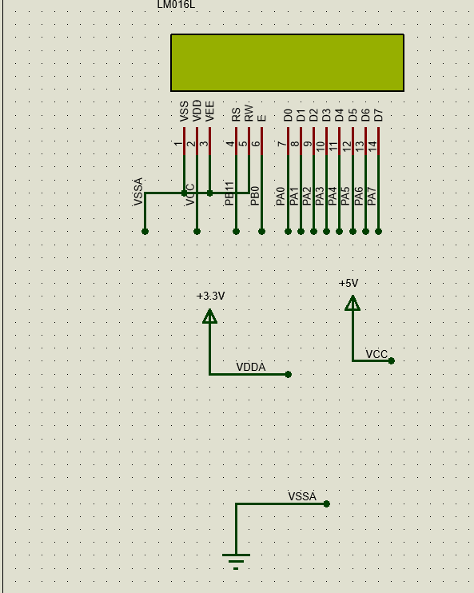

# Tela 
o modelo usado é uma tala LCD: LM016L
ela não contem i2c, eu fiz uma minibiblioteca para conseguirmos usar ela, para tanto usei pinos GPIO.
* [Display Lcd 16x2 Backlight Azul](https://www.autocorerobotica.com.br/display-lcd-16x2-hd44780?gad_source=1&gad_campaignid=22853318778&gbraid=0AAAAAqS-XyH58UkTMFT0CwEP9ddxJe1Y7&gclid=Cj0KCQiAvOjKBhC9ARIsAFvz5ljGau6xLiW526ToNS_zgclWzW_9zHztd8AsDzqcV6nNmyzwuikfKfIaAsI1EALw_wcB)

## Funcionamento da pinagem
Na parte de hardware, é conectado da seguinte forma:
| Pino do Keypad | Descrição | Conectado ao | Função no Firmware |
| :--- | :--- | :--- | :--- |
| **VSS** | aterramento | `GND` | alimentação |
| **VEE** | tensão negativa | `GND` | alimentação |
| **VCC** | tensão positiva | `5V`  | alimentação |
| **RS** | Register Select | `PB11` | 0 - envio de comando, 1 - envio de dados |
| **RW** | Read/Write | `GND` | define leitura ou escrita |
| **E** | Enable | `PB0` | pulso para ativar a escrita |
| **D0** | Data input | `PA0` | entrada de dados |
| **D1** |Data input | `PA1` | entrada de dado |
| **D1** |Data input | `PA2` | entrada de dado |
| **D1** |Data input | `PA3` | entrada de dado |
| **D1** |Data input | `PA4` | entrada de dado |
| **D1** |Data input | `PA5` | entrada de dado |
| **D1** |Data input | `PA6` | entrada de dado |
| **D1** |Data input | `PA7` | entrada de dado |



## Funcionamento da programação
    Eu programei a utilização desde um nivel lógico, mas acho melhor especificar mais a utilização para quem for usar. Contanto que vc tenha os seguintes requisitos poderá usar as funções. Eles ja estão no githube. Mas qualquer coisa falar comigo.
### Requisitos
1) arquivos .h
- LCD.h
- telas.h
2) arquivos .c
- LCD.c
- telas.h

OBS: as funções se baseiam em escrever e mover o cursor em uma das 2x16 casas dele (16 colunas, 2 linhas)
obs2: ele converte letras minusculas para maiusculas

### funções do LCD
1) LCD_init()
comece sempre com LCD_init() para configurar o LCD
```Cpp
    LCD_init();
```

2) write_letter(letter);
função para escrever uma letra. pede um char como parametro.
```Cpp
    write_letter('w');
```

3) write_word(msg);
função para escrever uma palavra (a palavra é bom ser menor que 16 caracteres para caber na tela). ele pede um array de caracteres terminasdos em '\0' como parametro.

```Cpp
    char msg[] = "hello";
  	write_word(msg);
```

4) write_tel(char* msg, char* msg2)
escreve a primeira mensagem na 1 linha, e a segunda na segunda linha. ele pede um array de caracteres terminasdos em '\0' como parametro.

```Cpp
    char msg[] = "A - INICIAR";
	char msg2[] = "B - INICIAR";
	write_tel(msg, msg2);
```

5) set_adress(coluna, linha);
seta o enderesso atual do cursor, onde sera escrita a proxima palavra, ele pede 2 inteiros, 
- coluna - vai de 0 a 15
- linha - vai de 0 a 1
```Cpp
    set_adress(4, 1);
```

6) LCD_clear
limpa o lcd e tras o cursor para o inicio
```Cpp
    LCD_clear();
```


### Telas
Também fiz algumas telas própias para o projeto, elas limpam a tela e trocam por outra


1) tela de inicio
printa:
```Cpp
    "A - INICIAR"
	"B - INICIAR"
```

2) Tela_forca(int tamanho_palavra)
tela do jogo da forca, pede o tamanho da palavra para determinar quantos '_' vai ter 
```Cpp
    "TENTATIVA:    X0"
	"_ _ _ _         "
```
3) tela_vitoria()
```Cpp
    "VVVVVVVVVVVVVVVV"
	"V VOCE GANHOU! V"
```

4) tela_derrota()
```Cpp
    "XXXXXXXXXXXXXXXX"
	"X !GAME OVER! X"
```
5) tela de load
imprimi 
```Cpp
    "carregando..."
```


## exemplo de utilização
```Cpp
    int main(void)
{

  HAL_Init();
  SystemClock_Config();
  MX_GPIO_Init();

  //LCD funções
  //iniciar
  LCD_init();
  HAL_Delay(1000);
  //enviar caractere, exemplo: W, minusculas virão maiusculas (tabela ACISS)
  write_letter('w');

  //enviar palavra, necessario um array de char terminado em '\0'
  	char msg[] = "ikkkac";
  	char msg2[] = "hello";
  	char msg3[] = "world!";

  	//enviando
  	write_word(msg);


  	//limpar o lcd
  	LCD_clear();

  	//setar o cursor, o primeiro é a coluna indo de 0 a 15, e o segundo, a linha, 0 ou 1.
  	set_adress(4, 0);

  	//testando
  	write_word(msg2);

  	//trocando linha
  	set_adress(4, 1);

  	//testando
  	 write_word(msg3);
  	 HAL_Delay(1000);


  	//tela 0 - carregando
  	 load();

  	 //Tela 1 - inicio
  	Tela_inicio();
  	HAL_Delay(2000);


  	//tela 2 - jogo
  	 //Tela 1

  	 int tamanho_palavra = 6;
  	 Tela_forca(tamanho_palavra);
  	 set_adress(11, 0);
  	 HAL_Delay(2000);


  	//TELA DE VITRORIA
  	tela_vitoria();
  	HAL_Delay(2000);
  	//TELA DE DERROTA
  	tela_derrota();
  	HAL_Delay(2000);


  while (1)
  {

  }
}
```